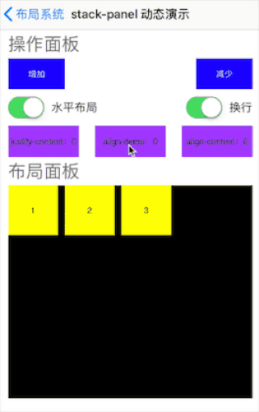

title: GICXMLLayout
---

# GICXMLLayout

`GICXMLLayout`以下简称`gic`，是一个以XML来描述UI的一个库，同时兼有MVVM的功能。`gic`能够做什么？

1. 以XML来描述UI、动画等。
2. 纯粹的MVVM
3. 支持`数据绑定`,类似h5中`Vue`提供的数据绑定能力
4. 支持`模板功能`类似于h5中的模板功能。
5. 强大的布局系统，甚至提供flex等复杂高效的布局
6. 强大的自定义能力，能够使得开发者按照自己的意愿扩展出能够直接使用XML来描述的任意功能。
7. 具有局部替换能力，可以对现有项目进行局部替换，使得局部功能具备MVVM+XML的能力。
8. 由于是直接采用XML来描述，因此天生具备实时更新的能力
9. `gic`的布局系统以及UI系统是基于`Texture`开发的，因此天生具有强大的性能优势

想要查看`gic`提供的sample可以直接将项目pull下来，然后在模拟器中运行查看，或者在真机上运行。模拟器中运行`动画`会自动停止，请以真机为准。

下面先给各位看两个例子。

1. flex布局演示

   

2. 模式头条Feeds页面

   

   上面模拟了头条7个模板。总共的xml代码也就100多行。

   ```xml
   <templates>
       <!--基础模板1-->
       <template t-name="base">
           <stack-panel>
               <template-slot slot-name = "content" space-before="10"/>
               <!--底部信息-->
               <stack-panel is-horizon="1" space="10" space-before="10" space-after="10">
                   <lable text="人民网" font-color="999999"/>
                   <lable text="15评论" font-color="999999"/>
                   <lable text="1小时前" font-color="999999"/>
               </stack-panel>
           </stack-panel>
       </template>
       <!--基础模板2-->
       <template t-name="base2">
           <stack-panel>
               <stack-panel is-horizon="1" space-before="10" space="10">
                   <image size="32" corner-radius="16" url="http://imgtu.5011.net/uploads/content/20170504/5905661493879766.jpg"/>
                   <stack-panel flex-grow="1" flex-shrink="1">
                       <lable text="海伟" font-size="14" font-color="191919"/>
                       <lable text="码农" font-color="999999"/>
                   </stack-panel>
                   <dock-panel width="50">
                       <lable text="关注" font-color="red" font-size="14"/>
                   </dock-panel>
               </stack-panel>
               <template-slot slot-name = "content" space-before="10"/>
               <!--底部信息-->
               <stack-panel is-horizon="1" space-before="10" space-after="10">
                   <stack-panel width="33%" is-horizon="1" justify-content="1" space="5" align-items="2">
                       <image local-name="zan"/>
                       <lable text="21" font-color="191919"/>
                   </stack-panel>
   
                   <stack-panel width="33%" is-horizon="1" justify-content="1" space="5" align-items="2">
                       <image local-name="zan"/>
                       <lable text="49" font-color="191919"/>
                   </stack-panel>
   
                   <stack-panel width="33%" is-horizon="1" justify-content="1" space="5" align-items="2">
                       <image local-name="zan"/>
                       <lable text="60" font-color="191919"/>
                   </stack-panel>
               </stack-panel>
           </stack-panel>
       </template>
       <!--feed模板1文字模板-->
       <template t-name="t1">
           <template-ref t-name="base">
               <lable text="国际社会积极评价习近平主席在金砖国家工商论坛上的重要讲话" slot-name="content" font-color="191919" font-size="24"/>
           </template-ref>
       </template>
       <!--feed模板2，文字加图片，图片16:9显示-->
       <template t-name="t2">
           <template-ref t-name="base">
               <stack-panel slot-name="content">
                   <lable text="国际社会积极评价习近平主席在金砖国家工商论坛上的重要讲话"  font-color="191919" font-size="24"/>
                   <stack-panel is-horizon="1" justify-content="3" space-before="10"  data-context='[1,2,3]'>
                       <for>
                           <ratio-panel width="32%" ratio="0.5625">
                               <inset-panel>
                                   <image url="http://img5.duitang.com/uploads/item/201204/01/20120401222440_eEjyC.thumb.700_0.jpeg"/>
                               </inset-panel>
                           </ratio-panel>
                       </for>
                   </stack-panel>
               </stack-panel>
           </template-ref>
       </template>
       <!--feed模板3，文字加图片，图片16:9显示，宽度为50%cell宽度-->
       <template t-name="t3">
           <template-ref t-name="base">
               <stack-panel slot-name="content" is-horizon="1">
                   <lable text="国际社会积极评价习近平主席在金砖国家工商论坛上的重要讲话" flex-grow="1" flex-shrink="1" font-color="191919" font-size="24" />
                   <ratio-panel width="32%" ratio="0.5625" space-before="10">
                       <inset-panel>
                           <image url="http://img5.duitang.com/uploads/item/201204/01/20120401222440_eEjyC.thumb.700_0.jpeg"/>
                       </inset-panel>
                   </ratio-panel>
               </stack-panel>
           </template-ref>
       </template>
       <!--feed模板4-->
       <template t-name="t4">
           <template-ref t-name="base">
               <stack-panel slot-name="content">
                   <lable text="国际社会积极评价习近平主席在金砖国家工商论坛上的重要讲话" flex-grow="1" flex-shrink="1" font-color="191919" font-size="24" lines="3"/>
                   <ratio-panel ratio="0.5625" space-before="10">
                       <image url="http://img5.duitang.com/uploads/item/201204/01/20120401222440_eEjyC.thumb.700_0.jpeg"/>
                   </ratio-panel>
               </stack-panel>
           </template-ref>
       </template>
       <!--feed模板5-->
       <template t-name="t5">
           <template-ref t-name="base2">
               <stack-panel slot-name="content">
                   <lable text="国际社会积极评价习近平主席在金砖国家工商论坛上的重要讲话" flex-grow="1" flex-shrink="1" font-color="191919" font-size="24" lines="3"/>
                   <ratio-panel ratio="0.5625" space-before="10" width="200">
                       <image url="http://img5.duitang.com/uploads/item/201204/01/20120401222440_eEjyC.thumb.700_0.jpeg"/>
                   </ratio-panel>
               </stack-panel>
           </template-ref>
       </template>
       <!--feed模板6-->
       <template t-name="t6">
           <template-ref t-name="base2">
               <stack-panel slot-name="content">
                   <lable text="国际社会积极评价习近平主席在金砖国家工商论坛上的重要讲话" flex-grow="1" flex-shrink="1" font-color="191919" font-size="24" lines="3"/>
                   <stack-panel is-horizon="1" justify-content="3" space-before="10"  data-context='[1,2,3]'>
                       <for>
                           <ratio-panel width="32%" ratio="0.5625">
                               <image url="http://img5.duitang.com/uploads/item/201204/01/20120401222440_eEjyC.thumb.700_0.jpeg"/>
                           </ratio-panel>
                       </for>
                   </stack-panel>
               </stack-panel>
           </template-ref>
       </template>
       <!--feed模板7-->
       <template t-name="t7">
           <template-ref t-name="base2">
               <stack-panel slot-name="content">
                   <lable text="国际社会积极评价习近平主席在金砖国家工商论坛上的重要讲话" flex-grow="1" flex-shrink="1" font-color="191919" font-size="24" lines="3"/>
                   <stack-panel is-horizon="1" space-before="10" space="10" align-items="2" background-color="efefef">
                       <ratio-panel width="80" ratio="0.75">
                           <image url="http://img5.duitang.com/uploads/item/201204/01/20120401222440_eEjyC.thumb.700_0.jpeg"/>
                       </ratio-panel>
                       <lable text="环球网：中国巴基斯坦加油！会哭会的哈哈但是上帝大大所大多撒多扫地哈哈是的哈哈" flex-grow="1" flex-shrink="1" font-size="14"/>
                   </stack-panel>
               </stack-panel>
           </template-ref>
       </template>
   </templates>
   ```

   上面代码是使用`template`来实现各个模板样式，您可以看到，相比于使用OC代码来写Cell，然后计算cell的height那样的方式来说，使用XML来写代码量是几何倍数的降低，你完全不需要计算cell的高度、设置cell的identifystring，由于`gic`支持数据绑定，因此完全可以纯MVVM模式来开发。非常的方便。

[项目地址](https://github.com/ghwghw4/GICXMLLayout)

[待开发功能列表](feature-list.html)

`gic`主要是解决了在iOS上开发UI费时费力的问题，而在使用`gic`的时候，你无需费心计算UI的frame，也无需使用autolayout布局。你可以看下sample中的一个模拟头条Feeds的例子，里面模拟了头条的8个模板，而实际用来描述UI的xml代码只需要100多行就能搞定，你无需计算cell的高度，也无需设置cell的identifystring，这个如果你采用autolayout、或者frame布局的情况下是不可能做到的(虽然底层还是iOS的frame那一套)，而且`gic`得益于`Texture`，在性能已经有了大幅度的优化，你可以在真机上跑下看看，滑动的时候没有卡顿的情况，用instrument的coreAnimation测试也不会有性能问题。你也可以横屏试试，横屏的时候会自动重新布局，而且没有任何的性能问题，在模拟头条feeds那个例子中，图片使用的是比例布局，你如果横屏的话，图片也会按照比例重新布局。

`gic`在布局系统上采用的是`Texture`布局系统，因此可以完整的支持`flex布局`,还有`比例布局`,`停靠布局`等一些常用的布局。通过不同的布局组合，可以实现很多复杂的布局。

使用gic，你可以使用纯粹的`MVVM模式`来开发，在`viewmodel`中你无需直接跟UI打交道，全部使用`数据绑定`来实现,就像h5中使用`vue`开发那样的简单。 

除看之下，您可能会觉得跟RN、weex等比较像，但是`gic`库的开发初衷并不是去替代`RN`、`weex`，`gic`的开发初衷就是简化`iOS`的开发，由于使用xml来写界面，因此顺带着具备远程更新UI的能力。如果您仔细看了例子中的`模拟头条Feeds`这个例子，您就会发现，写一个Feeds类的界面是多么的方便、高效率。而且依托于`Texture`，在性能上也有较大的优势。

您可以直接运行项目中的sample，直观的感受下`gic`库的优势。

事实上，`gic`也是有跨平台的潜力的，因为最起码对于UI层来说，`gic`就是一个元素、属性的map工具，因此在安卓上也能实现。

## 安装

1. 在项目的podfile中添加如下代码:

```ruby
pod 'GICXMLLayout'
```

2. 然后执行

```Ruby
pod update
```

3. 在AppDelegate 的`didFinishLaunchingWithOptions `方法下，注册所有元素。所有元素包括UI元素以及核心元素

   ```objective-c
   // 注册gic类库默认所有元素
   [GICXMLLayout regiterAllElements];
   ```

   或者你可以只注册核心元素即可。

   ```objective-c
   [GICXMLLayout regiterCoreElements];
   ```

   但是这样一来UI元素就必须全部使用你自定义的元素才行。

4. 解析xml文件。通过`GICXMLLayout`的`parseLayoutPage`直接解析一个页面

   ```objective-c
   NSData *xmlData = [NSData dataWithContentsOfFile:[[[NSBundle mainBundle] bundlePath] stringByAppendingString:@"/IndexPage.xml"]];
       [GICXMLLayout parseLayoutPage:xmlData withParseCompelete:^(UIViewController *page) {
           UINavigationController *nav =[[UINavigationController alloc] initWithRootViewController:page];
           self.window.rootViewController =nav;
       }];
   ```

   或者你可以通过`GICXMLLayout`的`parseLayoutView `解析一个view，然后将该view替换到已有的view之中。