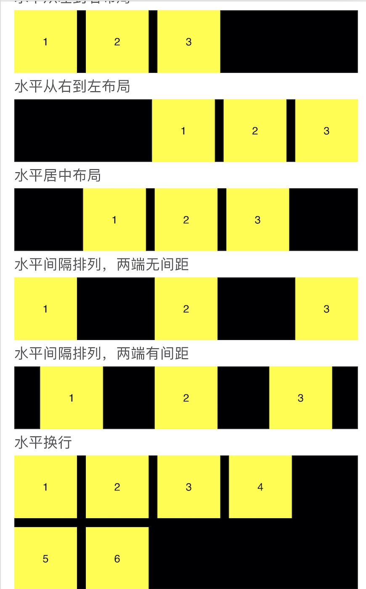

# stack-panel

`stack-panel`是一个支持flex布局的容器。何为flex布局，如果不了解的话，这里提供一个参考链接，可以看考下h5中的flex布局系统。

[flex布局参考链接](https://www.w3ctech.com/topic/2000)

[flex布局在线演示链接](http://www.css88.com/demo/flexbox-playground/)

也可以直接运行sample，查看sample中的`stack-panel动态演示`一节，直观的感受下flex布局。

## 属性

| 名称              | 数据类型        | 介绍                                       | 是否支持绑定 | 是否支持动画 |
| --------------- | ----------- | ---------------------------------------- | ------ | ------ |
| is-horizon      | Bool        | 是否水平布局。如果是true，那么是水平布局，否则垂直布局。默认false    | 是      | 是      |
| justify-content | Integer(枚举) | 主轴上的排列方式                                 | 是      | 是      |
| align-items     | Integer(枚举) | 交叉轴上的排列方式。这个属性只有在单行的情况的下才会生效。            | 是      | 是      |
| align-content   | Integer(枚举) | panel内的各个子元素没有占用交叉轴上所有可用的空间时对齐panel内的各个子元素。这个属性也只有在 `wrap`为true，并且有多行的情况下才会生效。 | 是      | 是      |
| wrap            | Bool        | 是否换行。默认false                             | 是      | 是      |
| space           | Float       | 子元素之间在主轴上的前后间距。默认0                       | 是      | 是      |
| line-space      | Float       | 子元素的行间距。默认0，只有在换行的情况下才生效。                | 是      | 是      |


## 属性枚举

###    justify-content

| 枚举值  | 对应枚举                                    | 说明         |
| ---- | --------------------------------------- | ---------- |
| 0    | ASStackLayoutJustifyContentStart        | 从前往后排列     |
| 1    | ASStackLayoutJustifyContentCenter       | 居中排列       |
| 2    | ASStackLayoutJustifyContentEnd          | 从后往前排列     |
| 3    | ASStackLayoutJustifyContentSpaceBetween | 间隔排列，两端无间隔 |
| 4    | ASStackLayoutJustifyContentSpaceAround  | 间隔排列，两端有间隔 |

示例：主轴居中排列

```xml
justify-content = "1"
```


### align-items

| 枚举值  | 对应枚举                                 | 说明                      |
| ---- | ------------------------------------ | ----------------------- |
| 0    | ASStackLayoutAlignItemsStart         | 从前往后排列                  |
| 1    | ASStackLayoutAlignItemsEnd           | 从后往前排列                  |
| 2    | ASStackLayoutAlignItemsCenter        | 居中排列                    |
| 3    | ASStackLayoutAlignItemsStretch       | 拉伸排列                    |
| 4    | ASStackLayoutAlignItemsBaselineFirst | 以第一个文字元素基线排列（主轴是横向才可用）  |
| 5    | ASStackLayoutAlignItemsBaselineLast  | 以最后一个文字元素基线排列（主轴是横向才可用） |

示例：交叉轴居中排列

```xml
align-items = "2"
```


### align-content

| 枚举值  | 对应枚举                                  | 说明         |
| ---- | ------------------------------------- | ---------- |
| 0    | ASStackLayoutAlignContentStart        | 从前往后排列     |
| 1    | ASStackLayoutAlignContentCenter       | 居中排列       |
| 2    | ASStackLayoutAlignContentEnd          | 从后往前排列     |
| 3    | ASStackLayoutAlignContentSpaceBetween | 间隔排列，两端无间隔 |
| 4    | ASStackLayoutAlignContentSpaceAround  | 间隔排列，两端有间隔 |
| 5    | ASStackLayoutAlignContentStretch      | 拉伸排列       |

示例：主轴居中对齐排列

```xml
align-content = "1"
```


示例：

